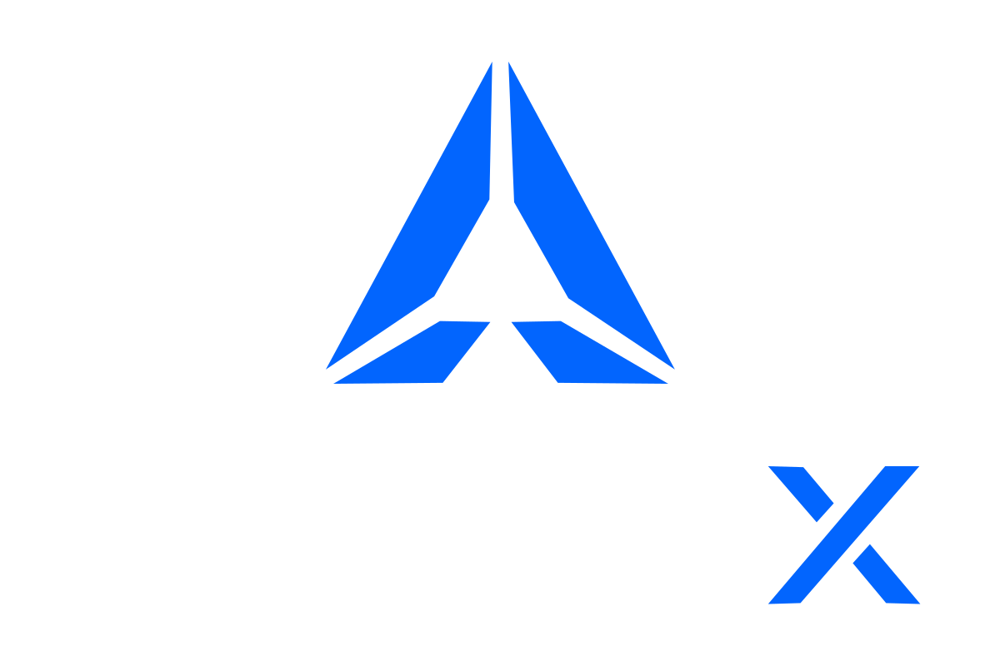

libFDX is a modular Java game framework focused on provider-neutral application, runtime, and graphics APIs. Game code is intended to depend on common API modules, while platform launchers choose the backend and provider stack.

libFDX is inspired by libGDX, but it is a new framework rather than a fork, port, or compatibility layer.

This repository is in early implementation. The detailed contracts live in the docs:

- [Architecture](docs/ARCHITECTURE.md): module layout, dependency direction, package roots, artifact naming, and provider boundaries.
- [Common API](docs/COMMON_API.md): provider-neutral public API contracts and behavior.

## Community

Join the [libFDX Discord](https://discord.gg/CutyWq27Gu) to ask questions, discuss the framework, and follow development.

## Requirements

- JDK available on `PATH`
- Gradle wrapper from this repository
- Desktop runtime support for the desktop sample
- Android SDK plus a connected device or emulator for Android launchers

Most common modules target Java 8 source and bytecode compatibility. Desktop FFM tasks require JDK 25 because the FFM binding runtimes are Java 25-only.

## Run The Basic Desktop Sample

From the repository root on Windows, use the task for the graphics stack you want:

```powershell
.\gradlew.bat :samples:basic:platform:desktop:run_open_gl_ffm
.\gradlew.bat :samples:basic:platform:desktop:run_open_gl_jni
.\gradlew.bat :samples:basic:platform:desktop:run_wgpu_jni
.\gradlew.bat :samples:basic:platform:desktop:run_wgpu_ffm
.\gradlew.bat :samples:basic:platform:desktop:run_vulkan_ffm
.\gradlew.bat :samples:basic:platform:desktop:run_vulkan_jni
```

## Run The Basic Android Sample

Use the task for the Android graphics stack you want:

```powershell
.\gradlew.bat :samples:basic:platform:android:run_gles
.\gradlew.bat :samples:basic:platform:android:run_wgpu_jni
.\gradlew.bat :samples:basic:platform:android:run_vulkan
.\gradlew.bat :samples:basic:platform:android:run_vulkan_fallback
```

## Run Provider Tests

The default selected test is `TestSelector.DEFAULT_TEST_NAME` in `tests:core`.
Select a specific test with `-Dlibfdx.test.name=texture`, `triangle`, `square`, `circle`, `sprite`, `model`, or `readback`.

### Desktop

The desktop test launcher opens a window, runs the selected graphics test, and keeps running until the window is closed:

```powershell
.\gradlew.bat :tests:platform:desktop:test_gl_ffm
.\gradlew.bat :tests:platform:desktop:test_gl_jni
.\gradlew.bat :tests:platform:desktop:test_wgpu_jni
.\gradlew.bat :tests:platform:desktop:test_wgpu_ffm
.\gradlew.bat :tests:platform:desktop:test_vulkan_ffm
.\gradlew.bat :tests:platform:desktop:test_vulkan_jni
```

Dedicated WGPU readback regression tasks run a finite invisible test and write `build/libfdx-readback/readback-orientation.ppm`:

```powershell
.\gradlew.bat :tests:platform:desktop:test_wgpu_jni_readback
.\gradlew.bat :tests:platform:desktop:test_wgpu_ffm_readback
```

LWJGL 3.4.x uses its Java 25 FFM backend automatically when the JVM selects the Java 25 multi-release classes. The generic `test_gl` and `test_vulkan` tasks also exist for current-JVM smoke runs and log the resolved mode at startup.

### Android

Android test launchers use the same selector:

```powershell
.\gradlew.bat :tests:platform:android:run_gles
.\gradlew.bat :tests:platform:android:run_wgpu_jni
.\gradlew.bat :tests:platform:android:run_vulkan
```

## Run Desktop Benchmark

The desktop benchmark task runs the SpriteBatch stress benchmark across OpenGL LWJGL FFM, OpenGL LWJGL JNI, WGPU JNI, WGPU FFM, Vulkan LWJGL FFM, and Vulkan LWJGL JNI. It uses visible windows, vSync disabled, the frame limiter disabled, 8191 rotating/scaling 32x32 sprites, and 8 seconds per provider:

```powershell
.\gradlew.bat :benchmark:platform:desktop:benchmark_desktop
```

The generated Markdown report is written to `build/reports/benchmark/desktop-sprite-batch-stress.md`.

## Design Shape

- Common game code receives a typed `Fdx` root and uses provider-neutral APIs such as `Display`, `Graphics`, and `GraphicsContext`.
- Backend and provider choices belong in launcher or platform modules.
- Provider-specific access is explicit through `providerId()` and `as()`.
- User-created systems such as asset managers, UI roots, sprite batches, and physics worlds stay explicit instead of being returned from a generic service locator.

## License

libFDX is licensed under the [Apache License 2.0](LICENSE).
